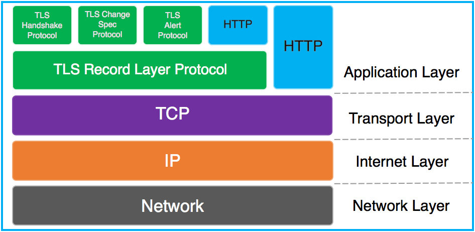
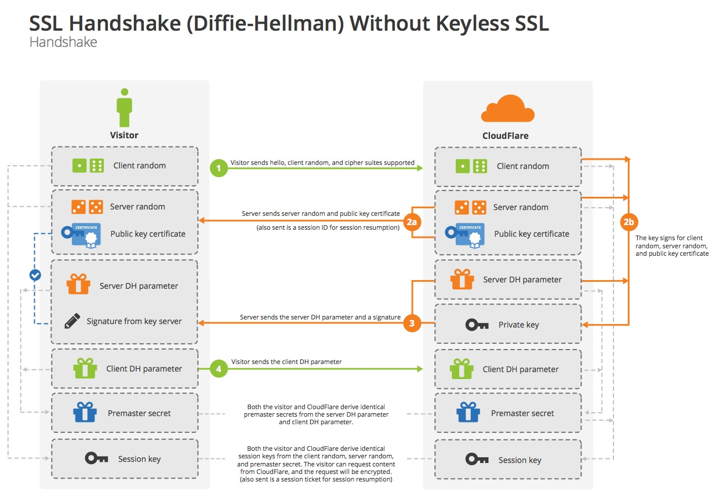
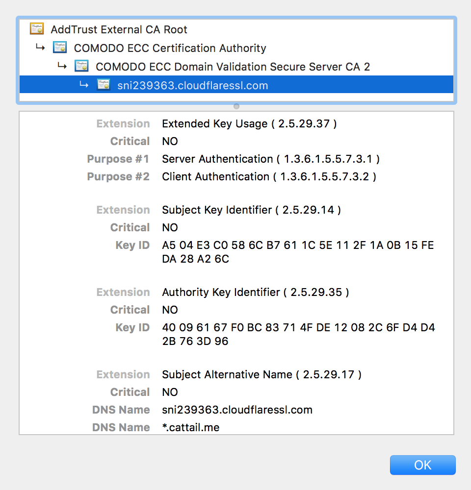

HTTPS工作原理
============

目标读者：理解HTTP协议，对称和非对称加密，想要了解HTTPS协议的工作原理，读完本文你能明白：

*	什么是HTTPS，TLS（SSL），TLS和HTTPS是什么关系、
*	什么是证书和数字签名，他们是如何传递信任的
*	HTTPS有什么样的功能，它是如何实现这样的功能的

## 简介

HTTPS，也称作HTTP over TLS。[TLS的前身是SSL](https://en.wikipedia.org/wiki/Transport_Layer_Security)，TLS1.0同城被标示为SSL3.1，TLS1.1为SSL3.2，TLS1.2为SSL3.3.本文着重藐视TLS协议的1.2版本

下图描述了在TCP/IP协议栈中TLS（各子协议）和HTTP的关系



> Credit: Kaushal Kumar Panday From: [SSL Handshake and HTTPS Bindings on IIS](https://blogs.msdn.microsoft.com/kaushal/2013/08/02/ssl-handshake-and-https-bindings-on-iis/)

其中Handshake protocol，Change Ciper Spec protocol和Alert protocol组成了SSL Handshaking Protocols。

HTTPS和HTTP协议想必提供了：

1.	数据完整性：内容传输经过完整性校验
2.	数据隐私性：内容经过对称加密，每一个连接生成一个唯一的加密密钥
3.	身份认证：第三方无法伪造服务端（客户端）身份

其中，数据完整性和隐私性由TLS Record Protocol保证，身份认证由TLS Handshaking Protocols实现。

## 总览

使用RSA算法的SSL握手过程是这样的



> Source: [Keyless SSL: The Nitty Gritty Technical Details](https://blog.cloudflare.com/keyless-ssl-the-nitty-gritty-technical-details/)

1.	[明文]客户端发送随机数`client_random`和支持的加密方式列表
2.	[明文]服务器返回随机数`server_random`，选择的加密方式和服务器生疏链
3.	[RSA]客户端验证服务端证书，使用证书中的公钥加密`premaster secret`发送给服务端
4.	服务端使用私钥解密`premaster secret`
5.	两端分别通过`client_random`,`server_random`和`premaster secret`生成`master secret`,用于对称加密后续通信内容

## 证书(Digital certificate)

那么什么是证书呢？



**证书中包含什么信息**

*	证书信息：过期时间和序列号
*	所有者信息：姓名等
*	所有者公钥

**为什么服务端要发送证书给客户端**

互联网有太多的服务需要使用证书来验证身份，以至于客户端（操作系统或浏览器等）无法内置所有证书，需要通过服务端将证书发送给客户端。

**客户端为什么要验证接收到的证书**

中间人攻击

```

客户端<------------攻击者<------------服务端
        伪造证书            拦截请求

```

**客户端如何验证接收到的证书**

为了回答这个问题，需要引入数字签名（Digital Signature）

```

+---------------------+
| A digital signature |
|(not to be confused  |
|with a digital       |
|certificate)         |            +---------+              +--------+
| is a mathematical   |----哈希--->| 消息摘要  |---私钥加密--->| 数字签名 |
|technique used       |            +---------+              +--------+
|to validate the      |
|authenticity and     |
|integrity of a       |
|message, software    |
|or digital document. |
+---------------------+


```

将一段文本通过哈希(hash)和私钥加密处理后生成数字签名。

假设消息在Bob，Suan和Pat三人之间发生。Suan将消息联通数字签名一起发送给Bob，Bob接收到消息后，可以这样验证收到的消息就是Suan发送的

```

+---------------------+
| A digital signature |
|(not to be confused  |
|with a digital       |
|certificate)         |            +---------+
| is a mathematical   |----哈希--->|  消息摘要 |
|technique used       |            +---------+
|to validate the      |                 |
|authenticity and     |                 |
|integrity of a       |                 |
|message, software    |                 对
|or digital document. |                 比
+---------------------+                 |
                                        |
                                        |
          +--------+               +---------+
          | 数字签名 |---公钥解密--->|  消息摘要 |
          +--------+               +---------+


```

当然这个前提是Bob知道Suan的公钥。更重要的是，和消息本身一样，公钥不能再不安全的网络中直接发给Bob

此时就引入了[证书颁发机构](https://en.wikipedia.org/wiki/Certificate_authority)（Certificate Authority，简称CA），CA数量并不多，Bob客户端内置了所有信任CA的证书。CA对Suan的公钥（和其他信息）数字签名后生成证书。

Bob信任CA，CA信任Suan使得Bob信任Suan，[信任链](https://en.wikipedia.org/wiki/Chain_of_trust)（Chain Of Trust）就是这样形成的。

事实上，Bob客户端内置的是CA的根证书（Root Certificate），HTTPS协议中服务器会发送证书链（Certificate Chain）给客户端。

## TLS协议

TLS协议包括TLS Record Protocol和TLS Handshake Protocol。总览中的流程图仅涉及到TLS Handshake Protocol。

## TLS Record Protocol

在TLS协议中，有四种子协议运行在Record Protocol之上

*	Handshake protocol
*	Alert protocol
*	Change cipher spec protocol
*	Application data protocol

Record protocol 起到了这样的作用：

*	在发送端：将数据分段，压缩，增加MAC和加密
*	在接收端：将数据解密，验证MAC，解压并重组

> 值得一提的是，Record protocol提供了数据完整性和隐私性保证，但Record类型和长度是公开传输的。

Record Protocol有三个连接状态(Connection State)，连接状态定义了压缩，加密和MAC算法。所有的Record都是被当前状态（Current State）确定的算法处理的。

TLS Handshake Protocol和Change Ciper Spec Protocol会导致Record Protocol状态切换。

```

empty state -------------------> pending state ------------------> current state
             Handshake Protocol                Change Cipher Spec

```

初始当前状态（Current State）没有指定加密，压缩和MAC算法，因而在完成TLS Handshaking Protocols一系列动作之前，客户端和服务端的数据都是明文传输的；当TLS完成握手过程后，客户端和服务端确定了加密，压缩和MAC算法及其参数，数据（Record）会通过指定算法处理。

> 其中，Record首先被加密，然后添加MAC（message authentication code）以保证数据完整性

## TLS Handshaking Protocols

Handshakeing protocols包括Alert Protocol，Change Ciper Spec Protocol和Handshake protocol。本文不会详细介绍Alert Protocol和Change Ciper Spec Protocol。

使用RSA算法的握手过程是这样的


> Source: [Keyless SSL: The Nitty Gritty Technical Details](https://blog.cloudflare.com/keyless-ssl-the-nitty-gritty-technical-details/)

客户端和服务端在握手hello消息中明文交换了`client_random`和`server_random`，使用RSA公钥加密传输`premaster secret`，最后通过算法，客户端和服务端分别计算`master secret`。其中，不直接使用`premaster secret`的原因是：保证secret的随机性不受任意一方的影响。

除了使用RSA算法在公共信道交换密钥，还可以通过Diddie-Hellman算法。
Diffie–Hellman算法的原理是这样的


> By Original schema: A.J. Han Vinck, University of Duisburg-Essen SVG version: Flugaal [Public domain], via Wikimedia Commons

使用Diffie-Hellman算法交换`premaster secret`的流程


> Source: [Keyless SSL: The Nitty Gritty Technical Details](https://blog.cloudflare.com/keyless-ssl-the-nitty-gritty-technical-details/)

## 小结

TLS Handshaking Protocols协商了TLS Record Protocol使用的算法和所需参数，并验证了服务端身份；TLS Record Protocol在协商后保证应用层数据的完整性和隐私性。

TLS Handshaking Protocol的核心是在公开信道上传递`premaster secret`。


参考链接：

1.	[TLS1.2规范：The Transport Layer Security (TLS) Protocol Version 1.2](https://tools.ietf.org/html/rfc5246)
2.	[PKI规范：Internet X.509 Public Key Infrastructure ](http://tools.ietf.org/html/rfc5280)Certificate and Certificate Revocation List (CRL) Profile
3.	[证书和数字签名：What is a Digital Signature?](http://www.youdzone.com/signature.html)
4.	[TLS Handshake：Keyless SSL: The Nitty Gritty Technical Details](https://blog.cloudflare.com/keyless-ssl-the-nitty-gritty-technical-details/)